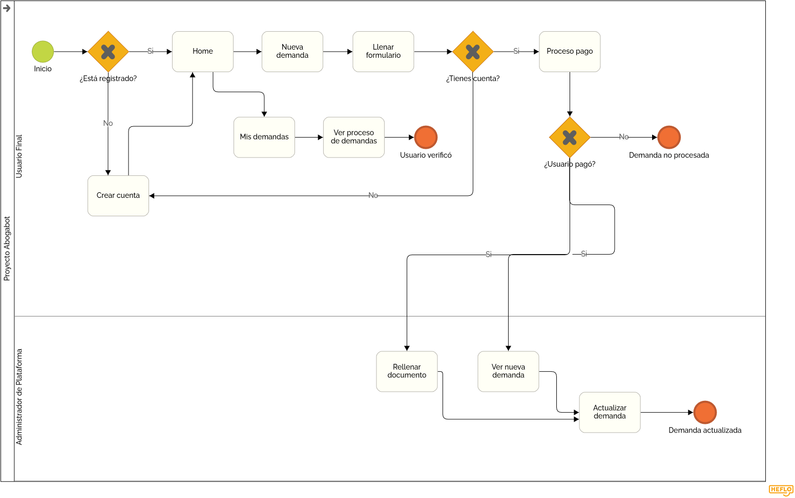
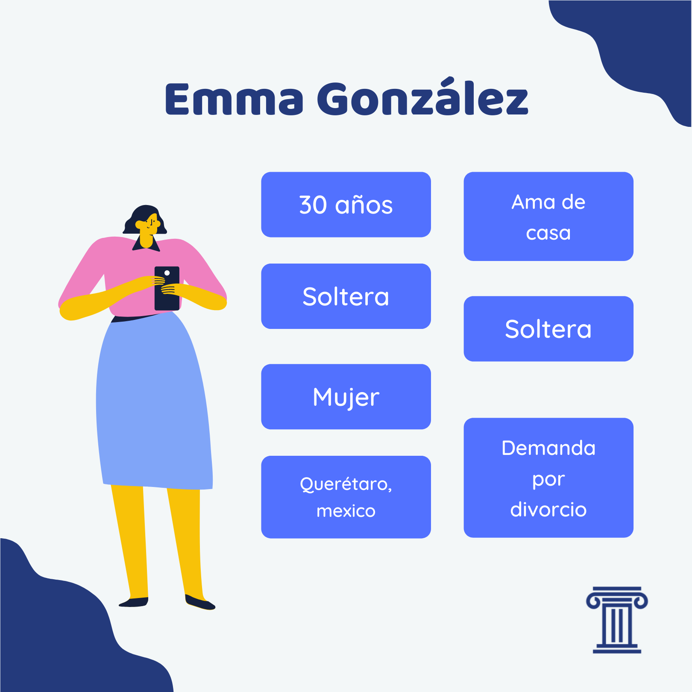
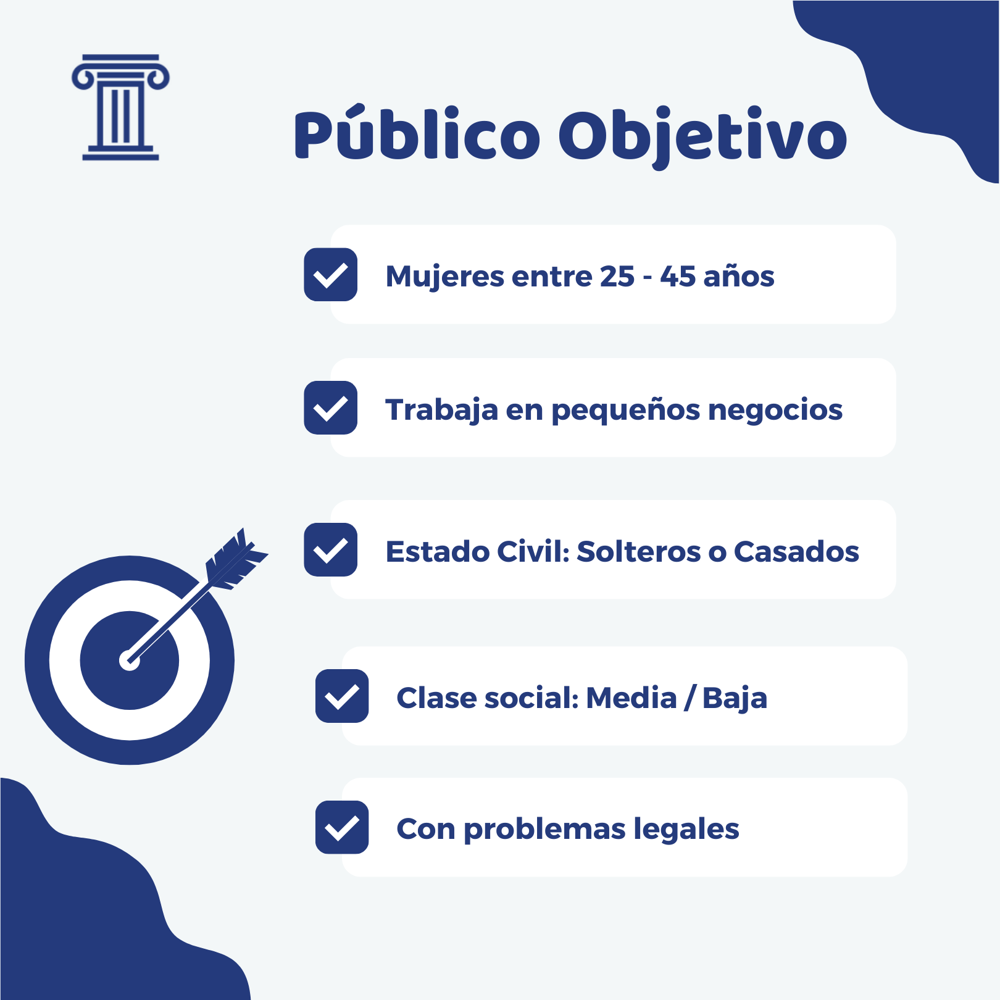
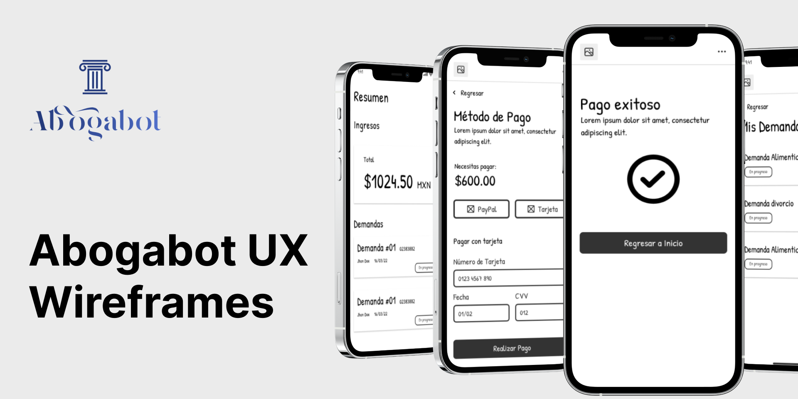
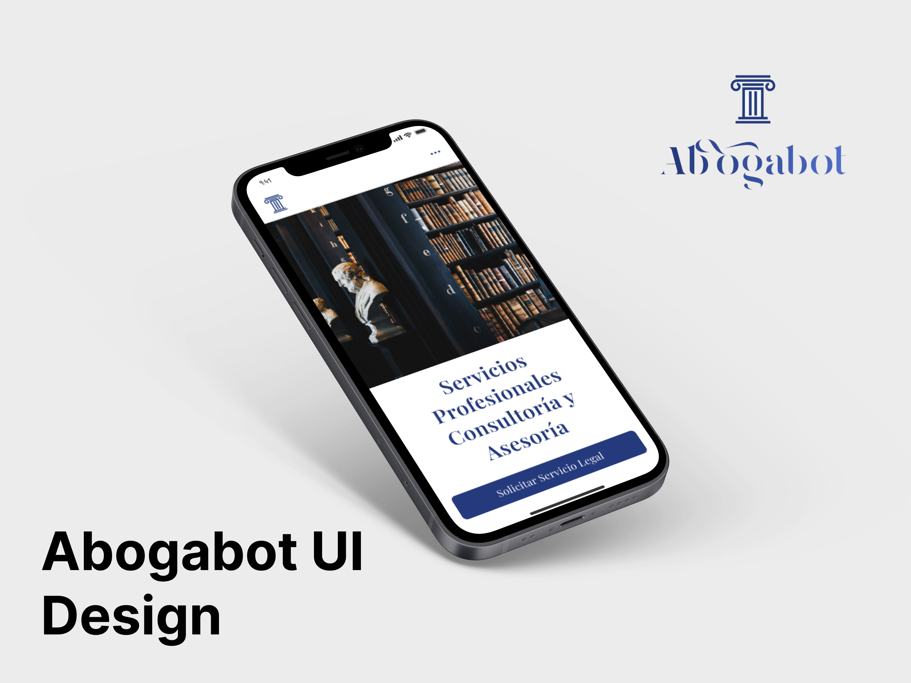

# Launch-X FrontEnd Mission 🚀 | Semana 1 - Práctica Requerimientos 🧠

## **Índice**

1. [Caso: Abogabot 🧑‍💼]()
2. [Toma de Requerimientos 🔎]()
3. [Buyer Persona 🧍]()
4. [Público Objetivo 🎯]()
5. [Wireframe UX 🧩]()
6. [UI Design 🎨]()

## **Caso: Abogabot 🧑‍💼**

Descripción: Despacho de abogados donde se quiere automatizar las demandas de sus clientes a través de un formulario de contacto.

## **Toma de Requerimientos 🔎**

En base a los requerimientos funcionales propuestos por el cliente se pueden encontrar los más destacables:

- Automatizar las demandas de sus clientes, esto lo harán a traves de una página web llenando un formulario.
-  Al llenar el formulario se mandará al proceso de pago para finalizar la transacción.
- Crear una cuenta en la plataforma y ver el seguimiento de cada una de las actualizaciones del proceso legal.
- El administrador del sitio recibirá la notificación de una nueva demanda y con los datos llenados del formulario se crea automaticamente el documento legal en formato word para empezar el proceso.
- El administrador recibe el pago y debe de ser capaz de verlo en un dashboard para ver la cantidad de ingresos recibidos.
-  Actualizar el proceso de la demanda y agrega comentarios en cada paso del proceso.
- Notificar por correo el avance de su proceso al cliente.

### Tipos de Usuarios

**Cliente:** Usuario principal de la aplicación. Este deberá de estar registrado previamente en la plataforma para poder poseer de los beneficios de la plataforma. El usuario podrá crear nuevas solicitudes y ver el progreso de los ya existentes que el posea.

**Administrador**: Usuario especial de la plataforma con permisos de admin para tener el control total de la plataforma. Podrá visualizar desde un Dashboard los ingresos totales, los pagos recibidos y las demandas actuales que estén en proceso. Podrá mandar notificaciones del avance de cada demanda de cada Cliente. También podrá actualizar y llevar un seguimiento de las demandas procesadas.

Recabando toda la información se puede tener un modelo de negocio como el siguiente:

>*El documento de completo de la Especificación de los Requerimientos puede consultarlo [aquí](./~$-Reqierimientos.doc).*

## **Buyer Persona 🧍**

Emma González, de 30 años de edad, trabajaba en la sección de Bienes Raices antes de casarse. Se encuentra actualmente soltera debido a la ruptura con su pareja, Emma se ecnarga ahora a tiempo completo de sus 2 niños. 
Emma dedica bastante tiempo al cuidado y educación de sus niños, y en sus tiempos libres usa internet para actualizarse y aprender cosas día con día.  
Debido a los recientes conflictos con su pareja, busca algún despacho para poder tramitar su proceso legal, pero por falta de tiempo, busca alguna solución en línea que pueda ayudarla con su caso y mantenerla informada mediante su teléfono móvil. 
   

## **Público Objetivo 🎯**

Personas entre 24 - 45 años, en su mayoría mujeres, trabaja en pequeñas o medianos negocios, son personas activas y trabajadoras, y por ello, tienen un estilo de vida ocupado, son modernos, utilizan mucho las redes sociales e Internet, les gusta estar informados en todo momento desde la comodidad de su hogar. Les agrada el orden y el control de cualquier situación.   

## **Wireframe UX 🧩**

En base a los requerimientos levantados anteriormente, y de acuerdo a la personalidad d enuestro Buyer Persona, se obtiene una estructura fácil de utilizar para los usuarios.

> Puedes consultar toda la estructura en [UX Design 🧩](https://www.figma.com/file/rO1X9AhdgtQsavmTSLwFwD/%F0%9F%9A%80-Launch-X-%7C-Abogabot?node-id=11%3A3).

## **UI Design 🎨**

De acuerdo a la conversación con el cliente, un requerimiento no funcional era la implementación de colores azul marino y blanco, logrando las siguientes vistas.

> Puedes consultar toda la estructura en [UI Design 🎨](https://www.figma.com/file/rO1X9AhdgtQsavmTSLwFwD/%F0%9F%9A%80-Launch-X-%7C-Abogabot?node-id=11%3A3).

 
Entregables desarrollados con base a los contenidos de la Semana 1 🚀| Frontend Mission del programa Launch X - Innovacción Virtual .